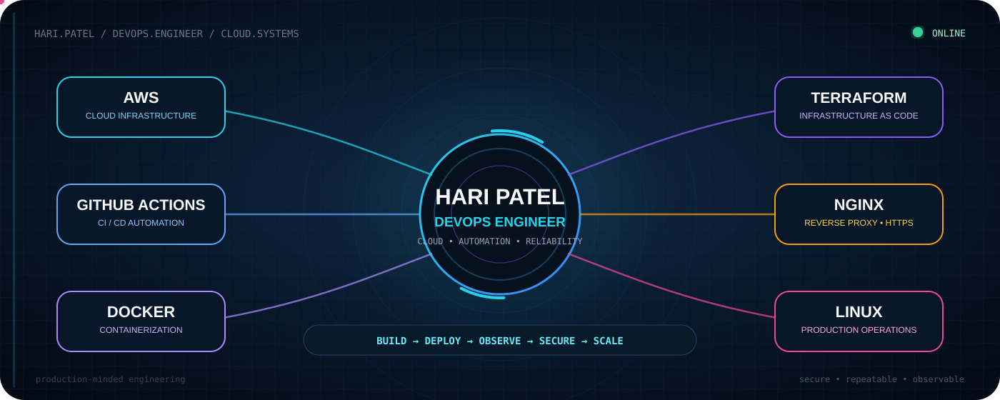
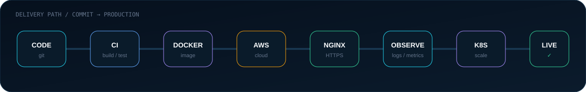
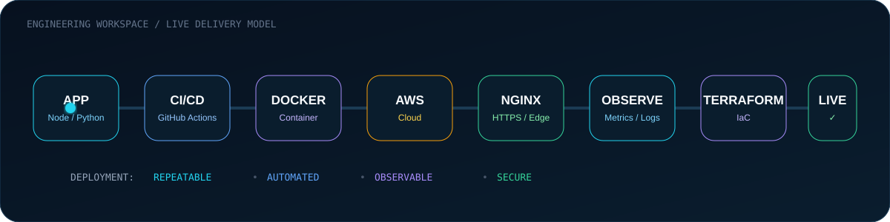

 

 

---

## 👨‍💻 Who I Am

**DevOps Engineer** focused on building reliable paths from **application code to production**.

I work with **AWS, Docker, GitHub Actions, Terraform, Linux, Nginx and Kubernetes**, backed by previous experience in **AI/ML, Computer Vision, backend and full-stack development**.

### Current direction

`Cloud Infrastructure` · `CI/CD` · `Containerization` · `Infrastructure as Code` · `Production Reliability`

---

---

## ⚡ What I Build

---

## ☁️ Cloud & Infrastructure

| Domain | Stack |
|---|---|
| **Cloud** | AWS · EC2 · VPC · IAM · Security Groups |
| **Containers** | Docker · Docker Compose |
| **CI/CD** | GitHub Actions |
| **Infrastructure as Code** | Terraform |
| **Orchestration** | Kubernetes |
| **Web / Edge** | Nginx · HTTPS · SSL/TLS |
| **Linux / Ops** | Linux · SSH · systemd · PM2 |
| **Observability** | Prometheus · Grafana |
| **Application** | Node.js · NestJS · Python · FastAPI |
| **Data** | PostgreSQL · MySQL · Redis |

---

## 🧰 Core Technology Stack

  

---

🤖 <b>AI/ML & Application Engineering Background</b>

 

My current direction is **DevOps & Cloud Engineering**, supported by previous experience in:

`AI / ML` · `Computer Vision` · `Python` · `FastAPI` · `Django` · `Node.js` · `NestJS` · `React` · `TypeScript`

Understanding the application layer helps me understand the infrastructure and delivery systems underneath it.

---

## 🧠 Engineering Principles

**AUTOMATE WHAT REPEATS**  
**OBSERVE WHAT RUNS**  
**SECURE WHAT MATTERS**  
**DOCUMENT WHAT BREAKS**

---

## 📊 GitHub Telemetry

  

---

## 🐍 Contribution Matrix

---

## 🎯 2026 Engineering Track

`LINUX` → `DOCKER` → `CI/CD` → `AWS` → `NGINX` → `HTTPS` → `TERRAFORM`

  

`KUBERNETES` → `OBSERVABILITY` → `ADVANCED AWS` → `SECURITY` → `RELIABILITY`

---

### ⚡ Build the system. Automate the path. Operate it well.

